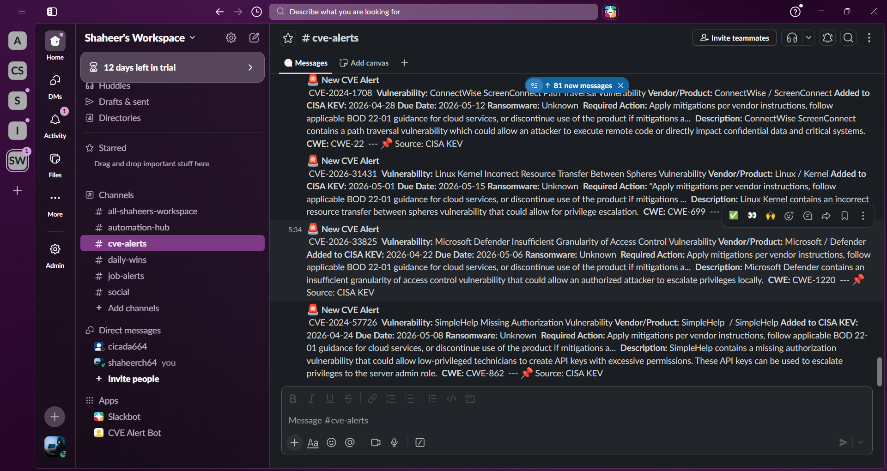
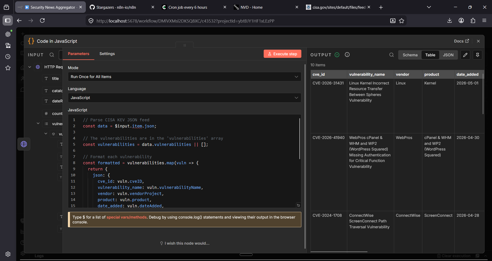

# Security News Aggregator

> Automated CISA KEV monitoring with real-time Slack alerts

[]()
[]()
[]()

## Overview

Production-ready n8n workflow that monitors CISA's Known Exploited Vulnerabilities catalog and delivers formatted security alerts to Slack. Runs automatically every 6 hours to keep security teams informed of actively exploited CVEs.

**Live Status:** ✅ Production ready and running

---

## Features

✅ **Automated CISA KEV Monitoring** - Pulls from authoritative CISA feed  
✅ **Smart Filtering** - Top 10 most recent CVEs  
✅ **Professional Formatting** - Clean, actionable Slack alerts  
✅ **Scheduled Execution** - Every 6 hours (00:00, 06:00, 12:00, 18:00)  
✅ **Rich CVE Data** - Vendor, product, dates, required actions, ransomware indicators  
✅ **Zero Configuration** - Runs locally with n8n

---

## Screenshots

### Complete Workflow


### Slack Output



### Code Formatting



---

## Tech Stack

| Component       | Technology             |
| --------------- | ---------------------- |
| **Automation**  | n8n                    |
| **Data Source** | CISA KEV JSON Feed     |
| **Formatting**  | JavaScript (Code node) |
| **Delivery**    | Slack Webhook          |
| **Schedule**    | Cron (every 6 hours)   |

---

## How It Works

**4-Node Workflow:**

1. **Schedule Trigger** → Runs every 6 hours
2. **HTTP Request** → Fetches CISA KEV JSON data
3. **Code (JavaScript)** → Formats and filters top 10 CVEs
4. **HTTP Request** → Sends formatted alerts to Slack

**Data Flow:**
CISA KEV Feed → Parse JSON → Format CVE Data → Slack Channel

---

## Installation

### Prerequisites

- n8n installed ([installation guide](https://docs.n8n.io/hosting/installation/))
- Slack workspace with admin access

### Setup Steps

1. **Install n8n** (if not already installed):

```bash
npm install -g n8n
```

2. **Start n8n**:

```bash
n8n
```

3. **Create Slack Webhook**:
   - Go to [Slack API Apps](https://api.slack.com/apps)
   - Create new app → Incoming Webhooks
   - Activate and add to channel
   - Copy webhook URL

4. **Import Workflow**:
   - Open n8n at `http://localhost:5678`
   - Import workflow (contact for JSON file)
   - Update HTTP Request node with your Slack webhook URL
   - Activate workflow

---

## Configuration

### Modifying Schedule

Edit the **Schedule Trigger** node to change frequency:

- Current: `0 */6 * * *` (every 6 hours)
- Every 12 hours: `0 */12 * * *`
- Daily at 9 AM: `0 9 * * *`

### Changing CVE Count

Edit the **Code** node and modify line 40:

```javascript
return formatted.slice(0, 10); // Change 10 to desired count
```

### Custom Slack Channel

Update webhook URL in **HTTP Request1** node to point to different channel.

---

## CVE Alert Format

Each alert includes:

- 🚨 CVE ID and vulnerability name
- Vendor and affected product
- CISA KEV addition date and remediation deadline
- Ransomware campaign indicator
- Required mitigation actions
- Technical description
- CWE classification
- Source attribution

---

## Project Structure

security-news-aggregator-n8n/
├── screenshots/
│ ├── workflow-complete.png # Full workflow view
│ ├── slack-cve-alerts.png # Formatted Slack output
│ ├── code-formatting.png # JavaScript formatting logic
│ └── cisa-data-fetch.png # Raw CISA data
├── workflows/
│ └── security-aggregator-v1.json (excluded from repo for security)
├── .gitignore
└── README.md

---

## Security Considerations

- Webhook URLs are excluded from version control via `.gitignore`
- CISA KEV data is public and safe to share
- No authentication required for CISA feed (public API)
- Slack webhook should be regenerated if accidentally exposed

---

## Future Enhancements

Potential additions (not currently implemented):

- [ ] Multi-source aggregation (NVD, Ubuntu, RedHat)
- [ ] CVSS score filtering
- [ ] Email notification option
- [ ] Database storage for historical tracking
- [ ] Web dashboard for CVE trends

---

## Why This Project?

Built as part of a 90-day AI x Cybersecurity learning journey to demonstrate:

- Security automation skills
- n8n workflow development
- API integration and data processing
- Production-ready tool development
- Real-world cybersecurity application

**Positioning:** AI Security Engineer building practical security tools

---

## License

MIT License - Free to use and modify

---

## Author

**Shaheer Hussain** ([@shaheersec](https://linktr.ee/shaheersec))

🎯 Top 5% TryHackMe | CEH Candidate  
🔐 Cybersecurity Professional | AI Security Engineer  
📍 Pakistan → UK (MSc Cyber Security)

**Connect:**

- [All Links](https://linktr.ee/shaheersec)
- GitHub: [@Shaheer-Cybersec](https://github.com/Shaheer-Cybersec)
- LinkedIn: [shaheer-hussain-cybersec](https://linkedin.com/in/shaheer-hussain-cybersec)

---

**Project Completed:** May 5, 2026  
**Status:** Production Ready ✅  
**Part of:** [90-Day AI x Cybersecurity Journey](https://github.com/Shaheer-Cybersec/ai-cybersecurity-journey)
